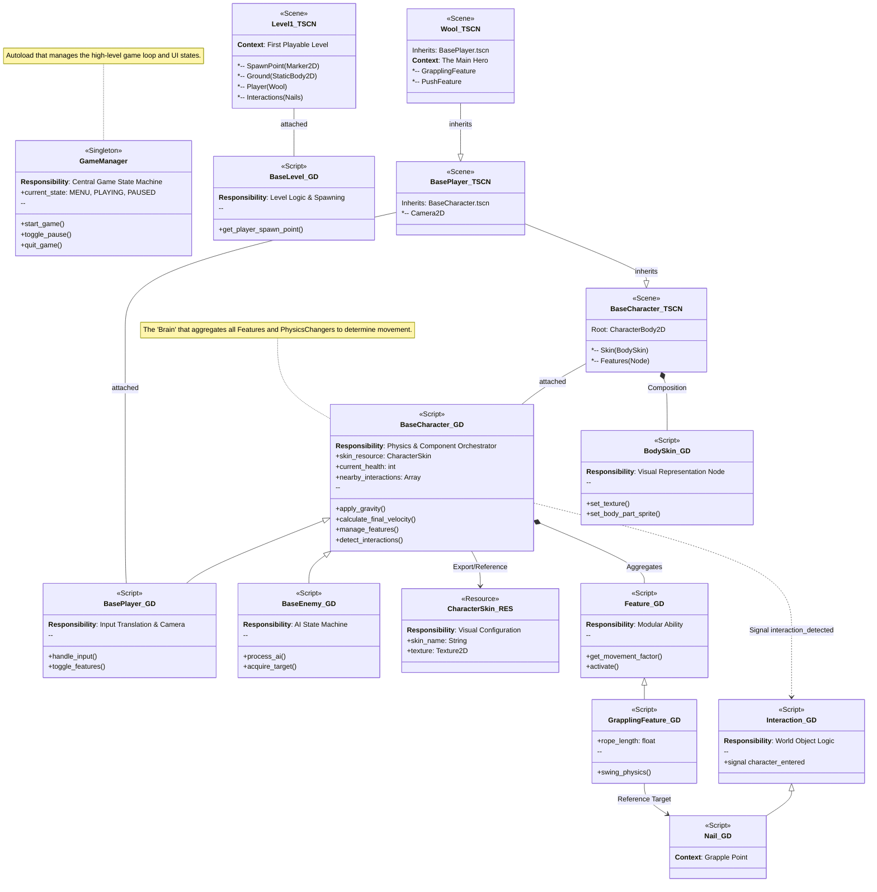

# Game Architecture Diagram

```mermaid
classDiagram
    %% ==========================================
    %% SINGLETONS & MANAGERS
    %% ==========================================
    class GameManager {
        <<Singleton>>
        **Responsibility**: Central Game State Machine
        +current_state: MENU, PLAYING, PAUSED
        --
        +start_game()
        +toggle_pause()
        +quit_game()
    }
    note for GameManager "Autoload that manages the high-level game loop and UI states."

    %% ==========================================
    %% LEVEL ARCHITECTURE
    %% ==========================================
    class BaseLevel_GD {
        <<Script>>
        **Responsibility**: Level Logic & Spawning
        --
        +get_player_spawn_point()
    }

    class Level1_TSCN {
        <<Scene>>
        **Context**: First Playable Level
        *-- SpawnPoint (Marker2D)
        *-- Ground (StaticBody2D)
        *-- Player (Wool)
        *-- Interactions (Nails)
    }

    Level1_TSCN -- BaseLevel_GD : attached

    %% ==========================================
    %% CHARACTER ARCHITECTURE
    %% ==========================================
    class BaseCharacter_GD {
        <<Script>>
        **Responsibility**: Physics & Component Orchestrator
        +skin_resource: CharacterSkin
        +current_health: int
        +nearby_interactions: Array
        --
        +apply_gravity()
        +calculate_final_velocity()
        +manage_features()
        +detect_interactions()
    }
    note for BaseCharacter_GD "The 'Brain' that aggregates all Features and PhysicsChangers to determine movement."

    class BasePlayer_GD {
        <<Script>>
        **Responsibility**: Input Translation & Camera
        --
        +handle_input()
        +toggle_features()
    }

    class BaseEnemy_GD {
        <<Script>>
        **Responsibility**: AI State Machine
        --
        +process_ai()
        +acquire_target()
    }

    BaseCharacter_GD <|-- BasePlayer_GD
    BaseCharacter_GD <|-- BaseEnemy_GD

    %% Scenes
    class BaseCharacter_TSCN {
        <<Scene>>
        Root: CharacterBody2D
        *-- Skin (BodySkin)
        *-- Features (Node)
    }

    class BasePlayer_TSCN {
        <<Scene>>
        Inherits: BaseCharacter.tscn
        *-- Camera2D
    }

    class Wool_TSCN {
        <<Scene>>
        Inherits: BasePlayer.tscn
        **Context**: The Main Hero
        *-- GrapplingFeature
        *-- PushFeature
    }

    BaseCharacter_TSCN -- BaseCharacter_GD : attached
    BasePlayer_TSCN -- BasePlayer_GD : attached

    BasePlayer_TSCN --|> BaseCharacter_TSCN : inherits
    Wool_TSCN --|> BasePlayer_TSCN : inherits

    %% ==========================================
    %% VISUALS & RESOURCES
    %% ==========================================
    class CharacterSkin_RES {
        <<Resource>>
        **Responsibility**: Visual Configuration
        +skin_name: String
        +texture: Texture2D
    }

    class BodySkin_GD {
        <<Script>>
        **Responsibility**: Visual Representation Node
        --
        +set_texture()
        +set_body_part_sprite()
    }

    BaseCharacter_GD --> CharacterSkin_RES : Export/Reference
    BaseCharacter_TSCN *-- BodySkin_GD : Composition

    %% ==========================================
    %% FEATURE SYSTEM
    %% ==========================================
    class Feature_GD {
        <<Script>>
        **Responsibility**: Modular Ability
        --
        +get_movement_factor()
        +activate()
    }

    class GrapplingFeature_GD {
        <<Script>>
        +rope_length: float
        --
        +swing_physics()
    }

    Feature_GD <|-- GrapplingFeature_GD
    BaseCharacter_GD *-- Feature_GD : Aggregates

    %% ==========================================
    %% INTERACTION SYSTEM
    %% ==========================================
    class Interaction_GD {
        <<Script>>
        **Responsibility**: World Object Logic
        --
        +signal character_entered
    }

    class Nail_GD {
        <<Script>>
        **Context**: Grapple Point
    }

    Interaction_GD <|-- Nail_GD
    BaseCharacter_GD ..> Interaction_GD : Signal interaction_detected
    GrapplingFeature_GD --> Nail_GD : Reference Target
```
